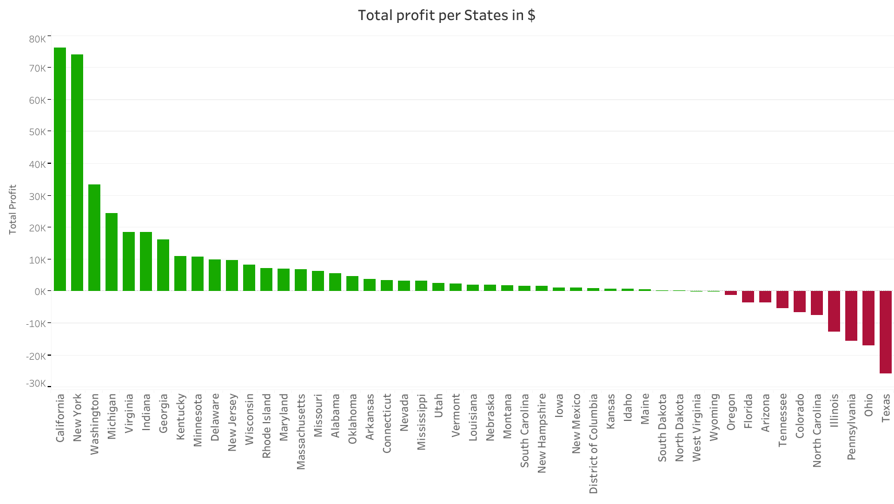
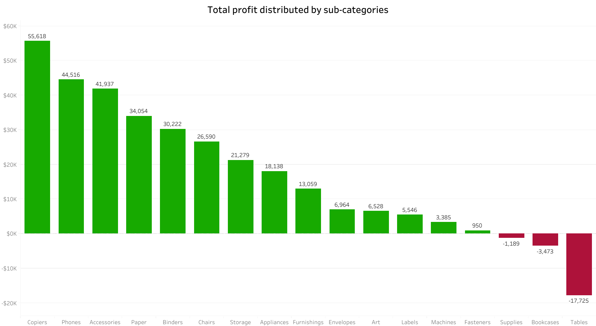
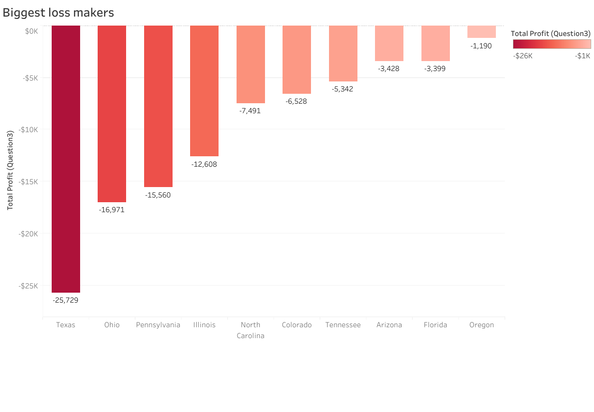
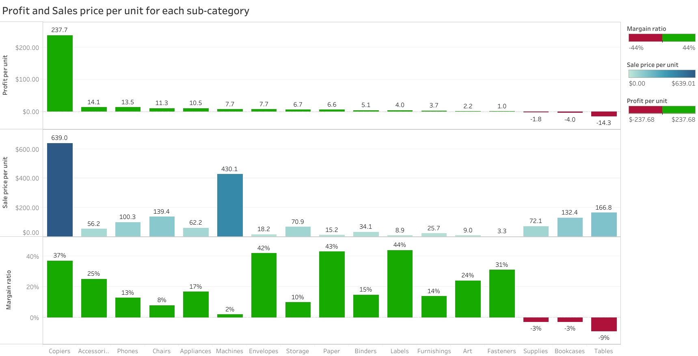
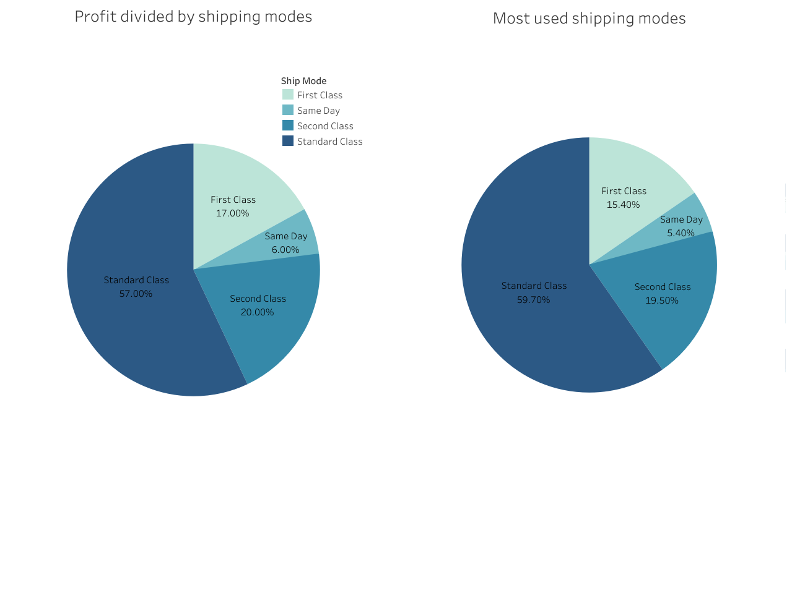
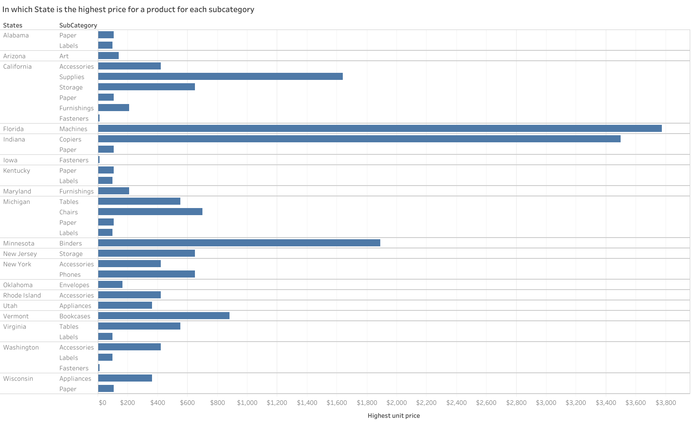

# 📊 SQL Data Analysis Project

## 🧠 Project Summary
This project is part of my journey to become a Data Analyst. I got the dataset on Kaggle. I downloaded the data and did a bulk import into MSSQL. I used SQL to analyze a dataset of Sample Superstore. Then I made a visualization from the queries in Tableau Public.

## 🔧 Tools
- MSSQL
- Tableau (for final visualization)

## Data Source
Sample Superstore: [Download here](https://www.kaggle.com/datasets/roopacalistus/superstore).

The dataset contains sales details of different stores of a supermarket chain that has multiple stores in different parts of the US.

## 📌 Objectives
- Get data
- Import data to MSSQL
- Answer specific business questions using SQL
- Visualize key insights

## 📈 Key questions that i answered
1. Which state has the highest sales?
2. Which sub_category has the highest profit?
3. Which states are generating losses?
4. What is profit per unit in each sub_category?
5. What is Margain ratio per each sub_category?
6. Which shipping mode is the most used and most profitable?
7. In which state is highest price for item in each sub_category?

# 📈 Data Analysis results
## 1. Which state has the highest sales?
This question helps identify the most valuable geographic market in terms of total revenue. Understanding top-performing states allows businesses to allocate resources more effectively and replicate success in other regions.

SQL query:
```sql
SELECT
   [State],
   ROUND(SUM([Profit]), 2) AS Total_Profit

FROM [Retail_supermarket].[dbo].[SampleSuperstore]
GROUP BY [State]
ORDER BY Total_Profit DESC;
```
Visualization:

[](Q1.png)


<br>

Visualization in Tableau: 
[Click here](https://public.tableau.com/app/profile/denis.struna/viz/Question1_17492323532630/Q1)

## 2. Which sub_category has the highest profit?
By isolating the most profitable product sub-category, this insight supports decisions around inventory focus, marketing efforts, and pricing strategies for maximizing returns.

SQL query:
```sql
SELECT
	[Sub_Category],
	ROUND(SUM([Profit]), 2) AS Total_Profit
FROM [Retail_supermarket].[dbo].[SampleSuperstore]
GROUP BY [Sub_Category]
ORDER BY Total_Profit DESC;
```
Visualization:

[](Q2.png)

Visualization in Tableau: 
[Click here](https://public.tableau.com/app/profile/denis.struna/viz/Question2_17492332552080/Q2?publish=yes)

## 3. Which states are generating losses?
Identifying states with negative profits is critical for risk management. It highlights areas that may suffer from high operational costs, poor customer engagement, or inefficient logistics.

SQL query:
```sql
SELECT
	[State],
	ROUND(SUM([Profit]), 2) AS Total_Profit
FROM [Retail_supermarket].[dbo].[SampleSuperstore]
GROUP BY [State]
HAVING SUM([Profit]) < 0
ORDER BY Total_Profit;
```
Visualization:

[](Q3.png)


Visualization in Tableau: 
[Click here](https://public.tableau.com/app/profile/denis.struna/viz/Question3_17492334172120/Q3?publish=yes)


## Two questions:
4. What is profit per unit in each sub_category?
Calculating profit per unit helps evaluate product efficiency and pricing effectiveness. It reveals which products provide the most return relative to volume sold.
   
5. What is Margain ratio per each sub_category?
Margin ratio shows how much of the revenue is actual profit. This helps prioritize products that not only sell well but also maintain a healthy profit margin.

SQL query:
```sql
SELECT
	Sub_Category,
	ROUND(SUM(Sales),2) AS Total_sales,							--Show Total sales
	ROUND(SUM(Profit),2) AS Total_profit,							--Show Total profit
	SUM(Quantity) AS Sold_items,								--Show Total quantity
	ROUND(SUM(Sales)/SUM(Quantity), 2) AS Average_sale_price,				--Show Absolute average price per one unit
	ROUND(SUM(Profit)/SUM(Quantity), 2) AS Average_profit_per_unit,				--Show Absolute average Profit per one unit sold
	CAST(ROUND(SUM(Profit)/SUM(Sales), 2) * 100 AS nvarchar) + '%' AS Margain_ratio		--Show Margain ratio in %

FROM Retail_supermarket.dbo.SampleSuperstore
WHERE Quantity > 0 AND Sales > 0
GROUP BY Sub_Category
ORDER BY Average_profit_per_unit DESC;
```
Visualization:

[](Q4.png)

Visualization in Tableau: 
[Click here](https://public.tableau.com/app/profile/denis.struna/viz/Question4_17492338293470/Q4?publish=yes)


## 6. Which shipping mode is the most used and most profitable?
This question combines operational and financial performance to identify the shipping method that balances customer preference and company profitability.

SQL query:
```sql
SELECT
	Ship_Mode,
	COUNT(Ship_Mode) AS Number_of_each_shipping,
	FORMAT(1.0 * COUNT(Ship_Mode) / SUM(COUNT(Ship_Mode)) OVER(), 'N3') AS Share_of_total_shipping,
	ROUND(SUM(Profit), 2) AS Profit_per_shipping,
	ROUND(SUM(Profit)/SUM(SUM(Profit)) OVER(), 2)AS Share_of_total_profit
FROM SampleSuperstore
GROUP BY Ship_Mode
ORDER BY Number_of_each_shipping DESC;
```
Visualization:
[](Q6.png)

Visualization in Tableau: 
[Click here](https://public.tableau.com/app/profile/denis.struna/viz/Question6_seperated/Dashboard1?publish=yes)


## 7. In which state is highest price for item in each sub_category?
This question explores regional pricing trends and purchasing behavior. It can help tailor pricing strategies or detect outliers in pricing data.

SQL query:
```sql
WITH RankedPrices AS(
SELECT
	Sub_Category,
	State,
	ROUND(Sales/Quantity, 2) AS Product_price,
	
	RANK() OVER(
		PARTITION BY Sub_Category
		ORDER BY Sales/Quantity DESC
	) AS Rank_in
	FROM SampleSuperstore
	WHERE Quantity > 0 
)		
SELECT
	DISTINCT Sub_Category,
	State,
	ROUND(Product_price, 2) AS Highest_unit_price

FROM RankedPrices
WHERE Rank_in = 1
ORDER BY Highest_unit_price DESC;
```
Visualization:
[](Q7.png)

Visualization in Tableau: 
[Click here](https://public.tableau.com/app/profile/denis.struna/viz/Question4_17492338293470/Q7?publish=yes)


## 📂 Project Structure
See folders for SQL queries, raw data, results, and visuals.


